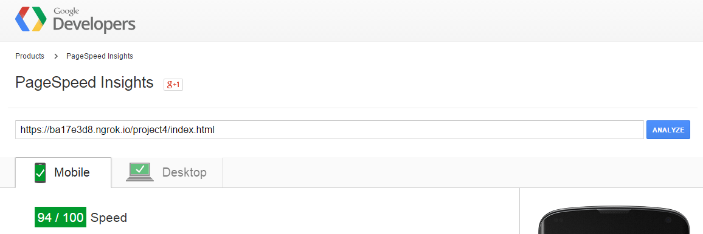
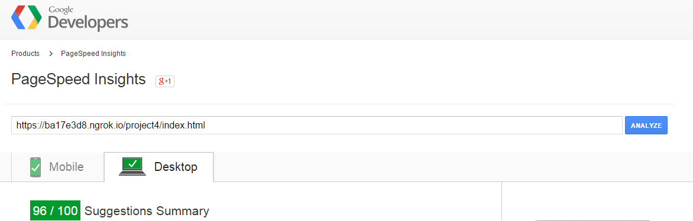
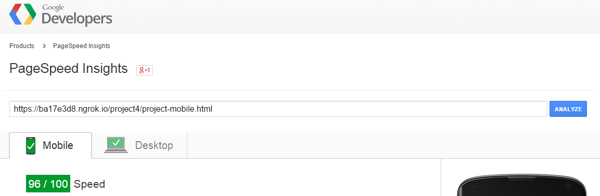
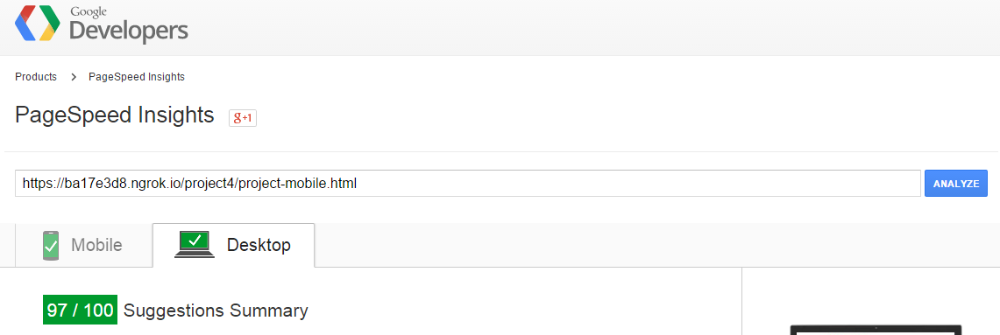
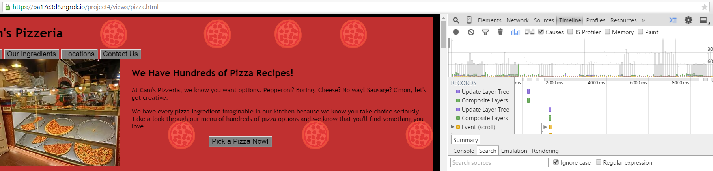

## Website Performance Optimization portfolio project

## Here are the results

	'I got a 94 pagespeed target for mobile on index.html'

	

	'I got a 96 pagespeed target for desktop on index.html'

	

	'I got a 96 pagespeed target for mobile on project-mobile.html'

	
	
	'I got a 97 pagespeed target for desktop on project-mobile.html'

	

1. I resized and used image compression for the images to load quicker
2. On the html page, the thumbnails had hyperlinks attached to them so I took those images and stored them locally in my image file
3. I minified the bootsrap CSS file 

!

	'I got below 60 fps on my pizza site'
1. I cleaned up the for loops by taking out the fields that declared variables and did the calculations outside the for loop.
2. Adjusted the amount of pieces that were to be made because the site looked similar when fewer pizzas were added.
3. I used Paul Lewis's debouncing method for my scroll events because my pizza site was constantly being reflowed and repainted in the for loop.
4. I used requestAnimationFrame to handle visual updates
5. I also used translate in CSS for the .mover class because it was more beneficial for paint time.- I saw this from Paul Irish's "Moving elements with translate is better video"

